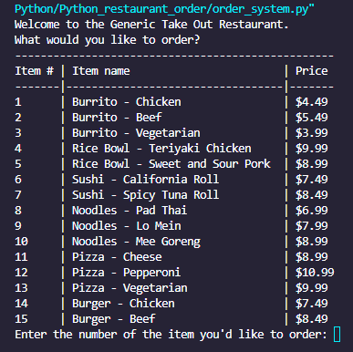

# Python_restaurant_order
A  restaurant ordering system that allows customers to select menu items, specify quantities, receive an itemized receipt, and calculate the total cost of their order.

## Description
The Restaurant Ordering System is designed to streamline the ordering process for both customers and restaurant staff. Users can browse the menu, customize their orders, and complete transactions efficiently. The system aims to enhance customer experience while optimizing restaurant operations.

## Table of Contents
1. [Description](#description)
2. [Table of Contents](#table-of-contents)
3. [Features](#features)
4. [Acceptance Criteria](#acceptance-criteria)
4. [Installation](#installation)
5. [Demonstration](#demonstration)
7. [Future Development](#future-development)
8. [Contributing](#contributing)
9. [Credits](#credits)
10. [Questions](#questions)
11. [License](#license)

## Features
**Key Uses**
- User-Friendly Interface: Customers can easily browse the menu and place orders.
- Order Customization: Allows modifications to dishes based on customer preferences.
- Real-Time Order Tracking: Displays the status of orders from preparation to delivery.
- Payment Integration: Supports multiple payment methods for seamless transactions.

**Core Functions**
- Menu Management: Restaurants can update items, descriptions, and prices dynamically.
- User Authentication: Secure login for customers and staff.
- Order Processing System: Efficiently manages orders from receipt to fulfillment.
- Admin Dashboard: Provides insights into sales, customer preferences, and operational efficiency.

## Acceptance Criteria
**User Story:**
```text
AS A hungry customer with hearing and vocal impairments
I WANT to view a menu, place an order, and see my receipt
SO THAT I don't have to interact with a person until I collect my food
```

**Acceptance Criteria:**
```text
GIVEN A restaurant order system
WHEN I launch the program
THEN I view all of the menu items listed with their category, name, and price
WHEN I select an item from the menu by entering a number
THEN I am asked the quantity of that item I want to order
WHEN I choose the quantity
THEN I am asked if I would like to continue ordering or not
WHEN I don't choose a valid quantity
THEN I automatically receive 1 of that menu item
WHEN I continue ordering
THEN I view the menu again
WHEN I quit ordering
THEN I am shown my itemized order receipt and total price
WHEN I enter an invalid response for the menu item
THEN I am given an error message
```

## Installation
This is a CLI app only. To use app please download and run in your terminal.

## Demonstration
   <div style="margin-left: 40px;">
   Menu:<br/>
   
   </div>
   <br/>

   <div style="margin-left: 40px;">
   Completed order:<br/>
   
   </div>
   <br/>

## Future Development
I do not plan to make any further developments on this project outside of using it as a learning and resource model.

## Contributing
Contributions are welcome and encouraged. To do so:
- Fork this repository.  
- Your pull request will need approval in order to merge to `main`.  
- Take a look at the [Future Development](#future-development) section to see what I am currently working on.

## Credits
This code was written as an exercise by the edX coding bootcamp and modified to function by me.

## Questions
If you have any questions, please reach out to me at:
- Email: [skylarkline16@gmail.com](mailto:skylarkline16@gmail.com)
- GitHub: [skylark-shae](https://github.com/skylark-shae)

## License

This project is licensed under the MIT license.

The MIT License is a permissive software license originating at the Massachusetts Institute of Technology (MIT) in the late 1980s. As a permissive license, it puts very few restrictions on reuse and therefore has high license compatibility.

For more information, visit [MIT Licensing](https://choosealicense.com/licenses/mit/).

---

© 2025 Sky-Shae Design. All Rights Reserved.
